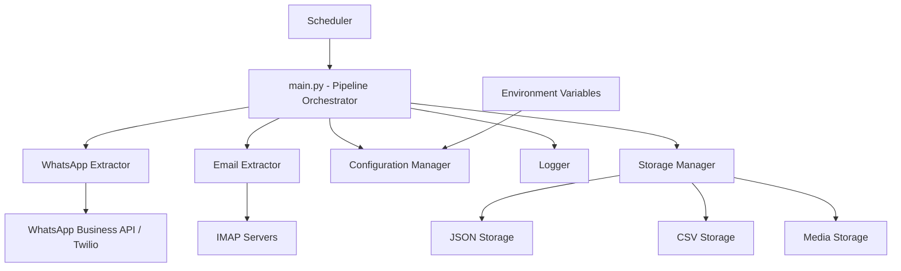

# Design Document

## Overview

The automated data extraction pipeline is designed as a modular Python application that extracts messages and attachments from WhatsApp and email sources. The system follows a plugin-based architecture where each data source (WhatsApp, Email) is implemented as an independent extractor module. The pipeline supports scheduled execution, comprehensive logging, secure credential management, and organized data storage.

## Architecture

### High-Level Architecture



### Core Design Principles

1. **Modularity**: Each data source is implemented as a separate, interchangeable module
2. **Configurability**: All settings managed through configuration files and environment variables
3. **Resilience**: Graceful error handling with detailed logging and recovery mechanisms
4. **Security**: No hardcoded credentials, secure API authentication
5. **Scalability**: Support for multiple accounts and extensible architecture

## Components and Interfaces

### 1. Pipeline Orchestrator (main.py)

**Purpose**: Central coordinator that manages the extraction workflow

**Key Responsibilities**:
- Initialize configuration and logging
- Coordinate extraction from all configured sources
- Handle scheduling and execution flow
- Manage error recovery and notifications

**Interface**:
```python
class PipelineOrchestrator:
    def __init__(self, config_path: str)
    def run_extraction(self) -> Dict[str, Any]
    def schedule_extraction(self, schedule_config: Dict) -> None
    def send_notifications(self, results: Dict) -> None
```

### 2. WhatsApp Extractor (whatsapp/whatsapp_extractor.py)

**Purpose**: Extract messages and media from WhatsApp using Business API or Twilio

**Key Responsibilities**:
- Authenticate with WhatsApp API services
- Retrieve messages with pagination support
- Download and organize media attachments
- Handle rate limiting and API errors

**Interface**:
```python
class WhatsAppExtractor:
    def __init__(self, config: Dict)
    def authenticate(self) -> bool
    def extract_messages(self, date_range: Optional[Tuple]) -> List[Dict]
    def download_media(self, media_url: str, filename: str) -> str
    def save_data(self, messages: List[Dict], output_path: str) -> None
```

**API Integration Strategy**:
- Primary: WhatsApp Business API (official, more reliable)
- Fallback: Twilio WhatsApp API (broader compatibility)
- Rate limiting: Exponential backoff with configurable limits
- Authentication: Bearer tokens stored in environment variables

### 3. Email Extractor (email/email_extractor.py)

**Purpose**: Extract emails and attachments from IMAP-compatible mail servers

**Key Responsibilities**:
- Connect to IMAP servers with OAuth2/app passwords
- Search and filter emails by date range and read status
- Extract email metadata and content (plain text and HTML)
- Download and organize attachments

**Interface**:
```python
class EmailExtractor:
    def __init__(self, config: Dict)
    def connect(self) -> bool
    def authenticate(self, auth_method: str) -> bool
    def extract_emails(self, filters: Dict) -> List[Dict]
    def download_attachments(self, email_id: str, output_path: str) -> List[str]
    def save_data(self, emails: List[Dict], output_path: str) -> None
```

**IMAP Integration Strategy**:
- Support for Gmail, Outlook, Yahoo, and generic IMAP servers
- OAuth2 for Gmail (using Google API client)
- App-specific passwords for other providers
- Connection pooling for multiple accounts
- Incremental sync to avoid re-processing

### 4. Configuration Manager (utils/config.py)

**Purpose**: Centralized configuration management with environment variable support

**Key Responsibilities**:
- Load configuration from files and environment variables
- Validate configuration parameters
- Provide secure credential access
- Support multiple account configurations

**Interface**:
```python
class ConfigManager:
    def __init__(self, config_file: str)
    def load_config(self) -> Dict
    def get_whatsapp_config(self) -> Dict
    def get_email_configs(self) -> List[Dict]
    def get_storage_config(self) -> Dict
    def validate_config(self) -> List[str]
```

### 5. Logger (utils/logger.py)

**Purpose**: Centralized logging with structured output and error tracking

**Key Responsibilities**:
- Configure logging levels and formats
- Provide structured logging for different components
- Handle log rotation and archival
- Support both file and console output

**Interface**:
```python
class PipelineLogger:
    def __init__(self, config: Dict)
    def setup_logging(self) -> None
    def log_extraction_start(self, source: str) -> None
    def log_extraction_complete(self, source: str, stats: Dict) -> None
    def log_error(self, component: str, error: Exception) -> None
```

### 6. Storage Manager (utils/storage.py)

**Purpose**: Manage data storage in multiple formats with organized directory structure

**Key Responsibilities**:
- Create organized directory structures
- Save data in JSON and CSV formats
- Handle file naming and deduplication
- Manage media file storage

**Interface**:
```python
class StorageManager:
    def __init__(self, base_path: str)
    def create_directory_structure(self, source: str, date: str) -> str
    def save_json(self, data: List[Dict], filepath: str) -> None
    def save_csv(self, data: List[Dict], filepath: str) -> None
    def save_media_file(self, content: bytes, filename: str, media_path: str) -> str
    def deduplicate_data(self, new_data: List[Dict], existing_data: List[Dict]) -> List[Dict]
```

## Data Models

### WhatsApp Message Model
```python
@dataclass
class WhatsAppMessage:
    id: str
    timestamp: datetime
    sender_phone: str
    message_content: str
    message_type: str  # text, image, audio, video, document
    media_url: Optional[str]
    media_filename: Optional[str]
    media_size: Optional[int]
    extracted_at: datetime
```

### Email Model
```python
@dataclass
class Email:
    id: str
    timestamp: datetime
    sender_email: str
    recipient_emails: List[str]
    subject: str
    body_text: str
    body_html: str
    attachments: List[Dict]  # filename, size, content_type
    is_read: bool
    folder: str
    extracted_at: datetime
```

### Extraction Result Model
```python
@dataclass
class ExtractionResult:
    source: str
    success: bool
    messages_count: int
    media_count: int
    errors: List[str]
    execution_time: float
    output_paths: Dict[str, str]
```

## Error Handling

### Error Categories and Strategies

1. **Authentication Errors**
   - Invalid credentials: Clear error message with setup instructions
   - Expired tokens: Automatic refresh where possible
   - Rate limiting: Exponential backoff with configurable delays

2. **Network Errors**
   - Connection timeouts: Retry with exponential backoff
   - API unavailability: Log error and continue with other sources
   - Partial failures: Save successful extractions, log failures

3. **Data Processing Errors**
   - Invalid message format: Log warning, skip message
   - Media download failures: Log error, continue with metadata
   - Storage errors: Retry with alternative paths

4. **Configuration Errors**
   - Missing credentials: Detailed setup instructions
   - Invalid paths: Create directories or suggest alternatives
   - Malformed config: Validation with specific error messages

### Error Recovery Mechanisms

- **Graceful Degradation**: Continue processing other sources if one fails
- **Partial Success Handling**: Save successfully extracted data even if some items fail
- **Retry Logic**: Configurable retry attempts with exponential backoff
- **Detailed Logging**: Comprehensive error context for troubleshooting

## Testing Strategy

### Unit Testing
- **Component Isolation**: Mock external APIs for reliable testing
- **Configuration Testing**: Validate config loading and validation logic
- **Data Processing**: Test message parsing and storage operations
- **Error Handling**: Verify error scenarios and recovery mechanisms

### Integration Testing
- **API Integration**: Test with sandbox/test API endpoints
- **End-to-End Workflows**: Complete extraction pipeline testing
- **Multi-Account Scenarios**: Test with multiple configured sources
- **Storage Validation**: Verify output format and organization

### Test Data Management
- **Mock Data**: Realistic test messages and emails
- **API Mocking**: Simulate various API responses and error conditions
- **File System Mocking**: Test storage operations without actual file I/O

### Performance Testing
- **Large Dataset Handling**: Test with high message volumes
- **Memory Usage**: Monitor memory consumption during extraction
- **Rate Limit Compliance**: Verify API rate limiting adherence
- **Concurrent Processing**: Test multiple account extraction

## Security Considerations

### Credential Management
- Environment variables for all sensitive data
- Support for .env files with .gitignore protection
- No credentials in logs or error messages
- Secure token storage and rotation

### Data Protection
- Local storage with appropriate file permissions
- Optional encryption for sensitive data
- Secure deletion of temporary files
- Audit logging for data access

### API Security
- HTTPS-only communication
- Token-based authentication
- Request signing where supported
- Rate limiting compliance

## Deployment and Configuration

### Directory Structure
```
/pipeline
    /whatsapp
        __init__.py
        whatsapp_extractor.py
    /email
        __init__.py
        email_extractor.py
    /utils
        __init__.py
        config.py
        logger.py
        storage.py
    main.py
    requirements.txt
    config.yaml
    .env.example
    README.md
```

### Configuration Files
- **config.yaml**: Main configuration with non-sensitive settings
- **.env**: Environment variables for credentials and sensitive data
- **logging.conf**: Logging configuration and levels

### Scheduling Integration
- **Cron Integration**: Standard cron job support
- **Python Scheduler**: Built-in scheduling with `schedule` library
- **Systemd Timer**: Linux service integration
- **Docker Support**: Containerized deployment option