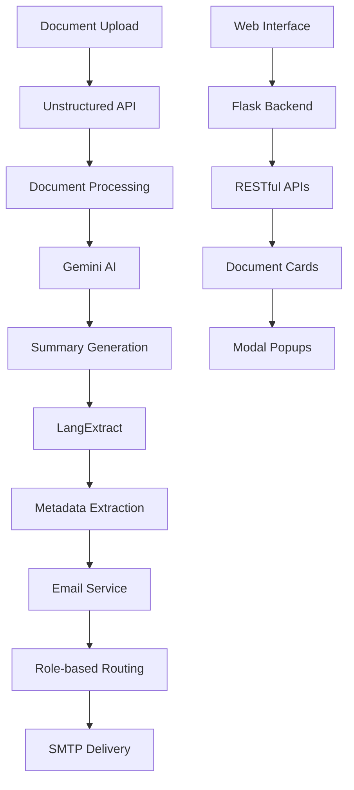

# Document Processing System

A clean and efficient document processing system using the Unstructured API.

## Features

- 📁 **File Upload**: Web interface for document upload
- 🔄 **API Processing**: Direct integration with Unstructured API
- 📝 **JSON to Markdown**: Convert structured data to readable format
- 🧠 **AI Summarization**: Generate intelligent summaries using Gemini AI
- 🌐 **Malayalam Translation**: Translate summaries to Malayalam language
- 🔍 **Side-by-side Comparison**: View original documents with confidence scores
- 🌐 **Web Interface**: Complete dashboard for file management

## Setup

1. **Install Dependencies**:
   ```bash
   pip install flask flask-cors python-dotenv requests google-generativeai
   ```

2. **Configure API Keys**:
   Create `.env` file:
   ```
   UNSTRUCTURED_API_KEY=your_unstructured_api_key_here
   GEMINI_API_KEY=your_gemini_api_key_here
   ```

3. **Run Application**:
   ```bash
   python app.py
   ```

4. **Access**: Open http://127.0.0.1:5000

## Usage

1. **Upload**: Upload documents via web interface
2. **Process**: Click "Process Documents" to send to API
3. **View**: Check results in JSON format
4. **Convert**: Convert JSON to Markdown for readability
5. **Summarize**: Generate AI summaries with Malayalam translations
6. **Compare**: Use side-by-side view with confidence scores

## Project Structure

```
unstructured/
├── app.py                 # Main Flask application
├── json_to_markdown.py    # JSON to Markdown converter
├── gemini_service.py      # AI summarization and translation
├── .env                   # API configuration
├── templates/             # HTML templates
├── uploads/               # Uploaded documents
├── output_documenty/      # JSON processing results
├── markdown_output/       # Converted Markdown files
└── summaries/             # AI summaries with translations
```

## Requirements

- Python 3.9+
- Valid Unstructured API key
- Valid Google Gemini API key
- Flask and dependencies (see app.py imports)# 🚄 KMRL Document Intelligence System

> **A comprehensive AI-powered document processing system designed for Kerala Metro Rail Limited (KMRL) operations. This system automates document processing, generates intelligent summaries, extracts metadata, and provides automated email assignment with role-based routing.**

[](https://python.org)
[](https://flask.palletsprojects.com/)
[](https://ai.google.dev/)
[](LICENSE)

## 🎯 Overview

The KMRL Document Intelligence System revolutionizes how railway organizations handle document workflows. Built with modern AI technologies, it provides end-to-end automation from document upload to intelligent assignment with beautiful, responsive web interface.

### 🌟 Key Highlights
- **🤖 AI-Powered Processing** - Unstructured API + Google Gemini + LangExtract
- **🌍 Bilingual Support** - English + Malayalam AI translations
- **📧 Smart Email Routing** - Role-based automatic assignment
- **🎨 Modern UI/UX** - Responsive design with glass morphism
- **⚡ Real-time Updates** - Live configuration reload without restart

---

## ✨ Features

### 🔍 Document Intelligence
| Feature | Description | Technology |
|---------|-------------|------------|
| **Multi-format Processing** | PDF, DOC, DOCX, TXT, Images | Unstructured API |
| **AI Summarization** | Intelligent content analysis | Google Gemini |
| **Bilingual Translation** | English + Malayalam summaries | Gemini AI |
| **Metadata Extraction** | KMRL-specific field detection | LangExtract |
| **Automated Pipeline** | One-click processing workflow | Custom Integration |

### 📧 Email Assignment System
| Feature | Description | Benefit |
|---------|-------------|---------|
| **Role Detection** | Automatic audience identification | Zero manual routing |
| **Professional Templates** | Rich HTML email formatting | Enhanced communication |
| **Attachment Handling** | Original document inclusion | Complete context |
| **Real-time Config** | Live email address updates | Demo flexibility |
| **SMTP Integration** | Gmail/Custom server support | Production ready |

### 🎨 User Interface
| Component | Features | Technology |
|-----------|----------|------------|
| **Document Cards** | Grid layout with action buttons | CSS Grid + Flexbox |
| **Modal System** | Upload, summary, metadata, assignment views | Vanilla JavaScript |
| **Animations** | Processing pipeline visualization | CSS Animations |
| **Responsive Design** | Mobile, tablet, desktop optimization | Media Queries |
| **Glass Morphism** | Modern blur effects and gradients | CSS Backdrop Filter |

---

## 🏗️ System Architecture



### 📁 Project Structure
```
InfoBox/
├── 🐍 Backend Components
│   ├── app_ui.py              # Flask web application
│   ├── gemini_service.py      # AI summarization service
│   ├── metadata_extractor.py  # Metadata extraction service
│   └── email_service.py       # Email assignment service
├── 🎨 Frontend
│   └── templates/
│       └── index.html         # Modern web interface
├── 🧪 Testing
│   └── test_email.py         # Email testing utility
├── 📋 Configuration
│   ├── .env                  # Environment variables (gitignored)
│   ├── .gitignore           # Git ignore rules
│   ├── requirements.txt     # Python dependencies
│   └── README.md           # This documentation
└── 📂 Data Directories (Auto-created)
    ├── uploads/             # Original documents
    ├── output_documenty/    # Processed JSON files
    ├── summaries/          # AI summaries
    └── metadata/           # Extracted metadata
```

---

## 🚀 Quick Start

### 📋 Prerequisites
- **Python 3.8+** - Programming language
- **Gmail Account** - For SMTP email functionality
- **API Keys** - Unstructured API + Google Gemini

### ⚡ Installation

1. **Clone Repository**
```bash
git clone https://github.com/hr7657316/InfoBox.git
cd InfoBox
```

2. **Setup Virtual Environment**
```bash
python -m venv .venv
source .venv/bin/activate  # Windows: .venv\Scripts\activate
```

3. **Install Dependencies**
```bash
pip install -r requirements.txt
```

4. **Configure Environment**
Create `.env` file with your credentials:
```env
# 🔑 API Keys
UNSTRUCTURED_API_KEY=your_unstructured_api_key_here
GOOGLE_API_KEY=your_gemini_api_key_here

# 📧 Email Configuration
EMAIL_USER=your_email@gmail.com
EMAIL_PASSWORD=your_gmail_app_password
SMTP_SERVER=smtp.gmail.com
SMTP_PORT=587

# 🏢 KMRL Role-based Email Addresses
HR_EMAIL=hr@kmrl.co.in
ENGINEER_EMAIL=engineer@kmrl.co.in
INSPECTOR_EMAIL=inspector@kmrl.co.in
CONTRACTOR_EMAIL=contractor@kmrl.co.in
MANAGER_EMAIL=manager@kmrl.co.in
FINANCE_EMAIL=finance@kmrl.co.in
GENERAL_EMAIL=general@kmrl.co.in
SAFETY_EMAIL=safety@kmrl.co.in
OPERATIONS_EMAIL=operations@kmrl.co.in
```

5. **Launch Application**
```bash
python app_ui.py
```

6. **Access System**
Open **http://127.0.0.1:8080** in your browser

---

## 📖 Usage Guide

### 📤 Document Upload & Processing

1. **Upload Documents**
   - Click **+** button in sidebar
   - Drag & drop files or browse
   - Supports: PDF, DOC, DOCX, TXT, Images

2. **Automated Processing**
   - Click **"Process Documents & Generate All"**
   - Watch animated pipeline:
     - 📄 Document parsing
     - 📊 Summary generation  
     - 🏷️ Metadata extraction

3. **View Results**
   - **📊 Summary** - AI summaries (English + Malayalam)
   - **🏷️ Metadata** - KMRL-specific structured fields
   - **📧 Assign Work** - Smart email routing
   - **📋 Full Report** - Complete technical data

### 📧 Email Assignment Workflow

1. **Smart Detection**
   - System analyzes document content
   - Identifies intended audiences
   - Maps to KMRL organizational roles

2. **Assignment Preview**
   - Click **"📧 Assign Work"**
   - Review detected recipients
   - Preview email content

3. **Professional Delivery**
   - HTML-formatted emails
   - Document summaries included
   - Original files attached
   - Deadline highlighting

---

## 🔧 Configuration

### 🔑 API Keys Setup

| Service | Purpose | How to Get |
|---------|---------|------------|
| **Unstructured API** | Document processing | [Get API Key](https://unstructured.io/) |
| **Google Gemini** | AI summarization | [Google AI Studio](https://makersuite.google.com/) |

### 📧 Email Configuration

1. **Gmail App Password**
   - Enable 2-Step Verification
   - Generate App Password
   - Use in `EMAIL_PASSWORD`

2. **SMTP Settings**
   ```env
   SMTP_SERVER=smtp.gmail.com
   SMTP_PORT=587
   ```

3. **Real-time Updates**
   - Use **🔄 Reload Config** button
   - Updates without server restart

---

## 🎯 KMRL-Specific Features

### 📋 Metadata Fields
- **Document Information**: Title, From/To, Date, Time
- **Action Items**: Deadlines, Job assignments
- **Organizational**: Departments, Personnel, Contractors
- **Categories**: HR, Engineering, Operations, Safety, Finance

### 👥 Role-based Routing
| Role | Typical Documents | Email Routing |
|------|------------------|---------------|
| **HR** | Personnel notices, policies | HR_EMAIL |
| **Engineer** | Technical reports, specifications | ENGINEER_EMAIL |
| **Inspector** | Safety reports, compliance | INSPECTOR_EMAIL |
| **Contractor** | Work orders, agreements | CONTRACTOR_EMAIL |
| **Manager** | Administrative documents | MANAGER_EMAIL |
| **Finance** | Budget reports, invoices | FINANCE_EMAIL |

---

## 🛠️ Development

### 🧪 Testing
```bash
# Test email functionality
python test_email.py

# Run with debug mode
python app_ui.py  # Debug enabled by default
```

### 🔄 API Endpoints
| Endpoint | Method | Purpose |
|----------|--------|---------|
| `/` | GET | Main dashboard |
| `/upload` | POST | File upload |
| `/process` | POST | Document processing |
| `/get-summary/<filename>` | GET | Retrieve summaries |
| `/get-metadata/<filename>` | GET | Retrieve metadata |
| `/assign-work/<filename>` | POST | Send assignment emails |
| `/reload-config` | POST | Reload configuration |

### 🎨 UI Components
- **Document Cards**: Grid-based layout
- **Modal System**: Upload, summary, metadata, assignment
- **Animations**: Processing pipeline visualization
- **Responsive**: Mobile-first design

---

## 🤝 Contributing

1. **Fork the repository**
2. **Create feature branch** (`git checkout -b feature/AmazingFeature`)
3. **Commit changes** (`git commit -m 'Add AmazingFeature'`)
4. **Push to branch** (`git push origin feature/AmazingFeature`)
5. **Open Pull Request**

---

## 📄 License

This project is licensed under the MIT License - see the [LICENSE](LICENSE) file for details.

---

## 🙏 Acknowledgments

- **KMRL** - Kerala Metro Rail Limited for operational insights
- **Unstructured.io** - Document processing capabilities
- **Google AI** - Gemini AI for intelligent summarization
- **LangExtract** - Metadata extraction framework

---

## 📞 Support

- **Issues**: [GitHub Issues](https://github.com/hr7657316/InfoBox/issues)
- **Discussions**: [GitHub Discussions](https://github.com/hr7657316/InfoBox/discussions)
- **Email**: Contact through GitHub profile

---

<div align="center">

**🚄 Built for KMRL Railway Operations | 🤖 Powered by AI | 🎨 Modern Web Design**

*Transforming document workflows with intelligent automation*

</div>
