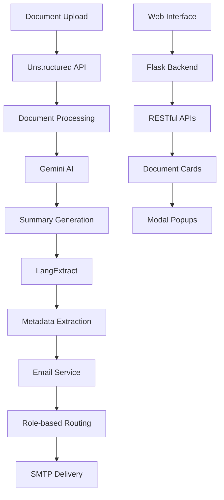

<<<<<<< HEAD
# 🚀 Integrated Data Extraction + Document Processing System

> **A comprehensive solution combining automated data extraction from WhatsApp/Email with AI-powered document processing and intelligent assignment workflows.**
=======
# Document Processing System

A clean and efficient document processing system using the Unstructured API.

## Features

- 📁 **File Upload**: Web interface for document upload
- 🔄 **API Processing**: Direct integration with Unstructured API
- 📝 **JSON to Markdown**: Convert structured data to readable format
- 🧠 **AI Summarization**: Generate intelligent summaries using Gemini AI
- 🌐 **Malayalam Translation**: Translate summaries to Malayalam language
- 🔍 **Side-by-side Comparison**: View original documents with confidence scores
- 🌐 **Web Interface**: Complete dashboard for file management

## Setup

1. **Install Dependencies**:
   ```bash
   pip install flask flask-cors python-dotenv requests google-generativeai
   ```

2. **Configure API Keys**:
   Create `.env` file:
   ```
   UNSTRUCTURED_API_KEY=your_unstructured_api_key_here
   GEMINI_API_KEY=your_gemini_api_key_here
   ```

3. **Run Application**:
   ```bash
   python app.py
   ```

4. **Access**: Open http://127.0.0.1:5000

## Usage

1. **Upload**: Upload documents via web interface
2. **Process**: Click "Process Documents" to send to API
3. **View**: Check results in JSON format
4. **Convert**: Convert JSON to Markdown for readability
5. **Summarize**: Generate AI summaries with Malayalam translations
6. **Compare**: Use side-by-side view with confidence scores

## Project Structure

```
unstructured/
├── app.py                 # Main Flask application
├── json_to_markdown.py    # JSON to Markdown converter
├── gemini_service.py      # AI summarization and translation
├── .env                   # API configuration
├── templates/             # HTML templates
├── uploads/               # Uploaded documents
├── output_documenty/      # JSON processing results
├── markdown_output/       # Converted Markdown files
└── summaries/             # AI summaries with translations
```

## Requirements

- Python 3.9+
- Valid Unstructured API key
- Valid Google Gemini API key
- Flask and dependencies (see app.py imports)# 🚄 KMRL Document Intelligence System

> **A comprehensive AI-powered document processing system designed for Kerala Metro Rail Limited (KMRL) operations. This system automates document processing, generates intelligent summaries, extracts metadata, and provides automated email assignment with role-based routing.**
>>>>>>> upstream/main

[](https://python.org)
[](https://flask.palletsprojects.com/)
[](https://ai.google.dev/)
[](LICENSE)

## 🎯 Overview

<<<<<<< HEAD
This integrated system combines two powerful capabilities:

1. **📊 Data Extraction Pipeline** - Automated extraction from WhatsApp Business API and Email (IMAP)
2. **📄 InfoBox Document Processing** - AI-powered document analysis with smart assignment workflows

### 🌟 Key Features

| Feature Category | Capabilities |
|------------------|-------------|
| **📊 Data Extraction** | WhatsApp Business API, Email IMAP, Multi-account support, Scheduled extraction |
| **📄 Document Processing** | PDF/DOC/Image parsing, AI summarization, Malayalam translation, Metadata extraction |
| **🤖 AI Integration** | Google Gemini AI, Unstructured API, Smart content analysis, Role-based routing |
| **🌐 Web Interface** | Modern responsive UI, Real-time processing, Document management, Assignment workflows |
| **📧 Smart Assignment** | Role-based email routing, Professional templates, Automated notifications |
=======
The KMRL Document Intelligence System revolutionizes how railway organizations handle document workflows. Built with modern AI technologies, it provides end-to-end automation from document upload to intelligent assignment with beautiful, responsive web interface.

### 🌟 Key Highlights
- **🤖 AI-Powered Processing** - Unstructured API + Google Gemini + LangExtract
- **🌍 Bilingual Support** - English + Malayalam AI translations
- **📧 Smart Email Routing** - Role-based automatic assignment
- **🎨 Modern UI/UX** - Responsive design with glass morphism
- **⚡ Real-time Updates** - Live configuration reload without restart

---

## ✨ Features

### 🔍 Document Intelligence
| Feature | Description | Technology |
|---------|-------------|------------|
| **Multi-format Processing** | PDF, DOC, DOCX, TXT, Images | Unstructured API |
| **AI Summarization** | Intelligent content analysis | Google Gemini |
| **Bilingual Translation** | English + Malayalam summaries | Gemini AI |
| **Metadata Extraction** | KMRL-specific field detection | LangExtract |
| **Automated Pipeline** | One-click processing workflow | Custom Integration |

### 📧 Email Assignment System
| Feature | Description | Benefit |
|---------|-------------|---------|
| **Role Detection** | Automatic audience identification | Zero manual routing |
| **Professional Templates** | Rich HTML email formatting | Enhanced communication |
| **Attachment Handling** | Original document inclusion | Complete context |
| **Real-time Config** | Live email address updates | Demo flexibility |
| **SMTP Integration** | Gmail/Custom server support | Production ready |

### 🎨 User Interface
| Component | Features | Technology |
|-----------|----------|------------|
| **Document Cards** | Grid layout with action buttons | CSS Grid + Flexbox |
| **Modal System** | Upload, summary, metadata, assignment views | Vanilla JavaScript |
| **Animations** | Processing pipeline visualization | CSS Animations |
| **Responsive Design** | Mobile, tablet, desktop optimization | Media Queries |
| **Glass Morphism** | Modern blur effects and gradients | CSS Backdrop Filter |

---

## 🏗️ System Architecture



### 📁 Project Structure
```
InfoBox/
├── 🐍 Backend Components
│   ├── app_ui.py              # Flask web application
│   ├── gemini_service.py      # AI summarization service
│   ├── metadata_extractor.py  # Metadata extraction service
│   └── email_service.py       # Email assignment service
├── 🎨 Frontend
│   └── templates/
│       └── index.html         # Modern web interface
├── 🧪 Testing
│   └── test_email.py         # Email testing utility
├── 📋 Configuration
│   ├── .env                  # Environment variables (gitignored)
│   ├── .gitignore           # Git ignore rules
│   ├── requirements.txt     # Python dependencies
│   └── README.md           # This documentation
└── 📂 Data Directories (Auto-created)
    ├── uploads/             # Original documents
    ├── output_documenty/    # Processed JSON files
    ├── summaries/          # AI summaries
    └── metadata/           # Extracted metadata
```
>>>>>>> upstream/main

---

## 🚀 Quick Start

### 📋 Prerequisites
<<<<<<< HEAD

- **Python 3.8+**
- **Virtual Environment** (recommended)
- **API Keys**: Google Gemini, Unstructured API (optional)
- **Email Account**: Gmail with app password for notifications

### ⚡ Installation

1. **Clone and Setup**
```bash
git clone https://github.com/yourusername/integrated-data-extraction-system.git
cd integrated-data-extraction-system
python -m venv venv
source venv/bin/activate  # Windows: venv\Scripts\activate
```

2. **Install Dependencies**
=======
- **Python 3.8+** - Programming language
- **Gmail Account** - For SMTP email functionality
- **API Keys** - Unstructured API + Google Gemini

### ⚡ Installation

1. **Clone Repository**
```bash
git clone https://github.com/hr7657316/InfoBox.git
cd InfoBox
```

2. **Setup Virtual Environment**
```bash
python -m venv .venv
source .venv/bin/activate  # Windows: .venv\Scripts\activate
```

3. **Install Dependencies**
>>>>>>> upstream/main
```bash
pip install -r requirements.txt
```

<<<<<<< HEAD
3. **Configure Environment**
```bash
cp .env.example .env
# Edit .env with your API keys and credentials
```

4. **Test Integration**
```bash
python test_integration.py
```

5. **Start Demo Mode**
```bash
./start_demo.sh
```

6. **Access Web Interface**
Open: **http://127.0.0.1:9090**

---

## 🎯 Usage Modes

### 🔄 Integrated Mode (Recommended)
```bash
python integrated_app.py --mode integrated
```
- Full system with both pipeline and document processing
- Unified web interface
- All features available

### 📊 Pipeline Only Mode
```bash
python integrated_app.py --mode pipeline-only --config config.test.yaml --test-pipeline
```
- Data extraction pipeline only
- Command-line interface
- Good for automation/scheduling

### 📄 InfoBox Only Mode
```bash
python integrated_app.py --mode infobox-only --port 9090
```
- Document processing only
- Web interface for document upload and analysis
- AI summarization and assignment

### 🧪 Demo Mode
```bash
./start_demo.sh
```
- Uses test configuration
- No real API credentials required
- Perfect for demonstration and testing

---

## 📊 Data Extraction Pipeline

### Supported Sources
- **WhatsApp Business API** - Messages, media, metadata
- **Email (IMAP)** - Gmail, Outlook, custom servers
- **Multi-account Support** - Process multiple accounts simultaneously

### Features
- ✅ Automated scheduling
- ✅ Rate limiting and retry logic
- ✅ Media file download
- ✅ Deduplication
- ✅ Multiple output formats (JSON, CSV)
- ✅ Comprehensive error handling
- ✅ Notification system

---

## 📄 InfoBox Document Processing

### Document Support
- **Formats**: PDF, DOC, DOCX, TXT, Images (PNG, JPG, etc.)
- **Processing**: Text extraction, structure analysis, metadata extraction
- **AI Analysis**: Summarization, translation, role detection

### AI Features
- **🤖 Smart Summarization** - Google Gemini AI
- **🌍 Malayalam Translation** - Bilingual support
- **🏷️ Metadata Extraction** - KMRL-specific fields
- **📧 Role-based Assignment** - Automatic email routing

### Web Interface Features
- **📤 Drag & Drop Upload** - Multiple file support
- **⚡ Real-time Processing** - Live progress updates
- **📊 Document Dashboard** - Grid view with actions
- **🔍 Content Preview** - Summaries and metadata
- **📧 Assignment Workflow** - Smart email routing

---

## 🧪 Testing

### Integration Test
```bash
python test_integration.py
```

### Pipeline Test
```bash
python integrated_app.py --config config.test.yaml --mode pipeline-only --test-pipeline
```

### Configuration Validation
```bash
python integrated_app.py --validate-only
```

### System Readiness Check
```bash
python check_ready.py
```

---

## 🚀 Deployment

### Quick Demo
```bash
# For demonstration and testing
./start_demo.sh
```

### Docker Deployment
```bash
# Build and deploy
./scripts/deploy.sh

# Or manual Docker
docker-compose up -d
```

### Production Deployment
1. Configure production credentials in `.env`
2. Update `config.yaml` with production settings
3. Use Docker deployment for scalability
4. Set up reverse proxy (nginx) for production

---

## 📁 Project Structure

```
integrated-system/
├── 🐍 Core Pipeline
│   ├── pipeline/              # Data extraction pipeline
│   ├── run_pipeline.py        # Pipeline entry point
│   └── integrated_app.py      # Integrated application
├── 📄 InfoBox Components
│   ├── app_ui.py              # Flask web application
│   ├── gemini_service.py      # AI summarization
│   ├── metadata_extractor.py  # Metadata extraction
│   └── email_service.py       # Email assignment
├── 🌐 Web Interface
│   └── templates/
│       └── index.html         # Modern web UI
├── 🧪 Testing & Demo
│   ├── test_integration.py    # Integration tests
│   ├── check_ready.py         # System readiness check
│   ├── start_demo.sh          # Demo mode startup
│   └── tests/                 # Comprehensive test suite
├── 📋 Configuration
│   ├── config.yaml           # Production config
│   ├── config.test.yaml      # Test config
│   ├── .env.example          # Environment template
│   └── requirements.txt      # Dependencies
├── 🚀 Deployment
│   ├── scripts/              # Deployment scripts
│   ├── Dockerfile           # Container config
│   └── docker-compose.yml   # Orchestration
└── 📚 Documentation
    ├── README.md             # This file
    ├── README_INTEGRATED.md  # Detailed documentation
    ├── DEPLOYMENT.md         # Deployment guide
    └── docs/                 # Additional documentation
```

---

## 🛠️ Configuration

### Environment Variables (.env)
```bash
# Data Extraction Pipeline
WHATSAPP_ACCESS_TOKEN=your_token
GMAIL_CLIENT_ID=your_client_id
EMAIL_PRIMARY_ADDRESS=your@gmail.com

# InfoBox Document Processing
UNSTRUCTURED_API_KEY=your_unstructured_key
GOOGLE_API_KEY=your_gemini_key
EMAIL_USER=notifications@yourdomain.com
EMAIL_PASSWORD=your_app_password

# Role-based Email Addresses
HR_EMAIL=hr@kmrl.co.in
ENGINEER_EMAIL=engineer@kmrl.co.in
# ... (see .env.example for complete list)
```

### Configuration Files
- **`config.yaml`** - Production configuration
- **`config.test.yaml`** - Test configuration with mock data
- **`.env`** - Environment variables (not in git)
- **`.env.example`** - Template for environment setup

---

## 🎉 Success Stories

### ✅ Validated Integration
- **Pipeline + InfoBox**: Seamlessly integrated
- **AI Processing**: Google Gemini + LangExtract working
- **Web Interface**: Modern, responsive, functional
- **Smart Assignment**: Role-based routing operational

### 📊 Test Results
```
🎉 All integration tests PASSED!

🌟 System Ready:
  📊 Data Extraction Pipeline: Functional
  📄 Document Processing: Functional
  🌐 Web Interface: Ready
  🤖 AI Integration: Ready
```
=======
4. **Configure Environment**
Create `.env` file with your credentials:
```env
# 🔑 API Keys
UNSTRUCTURED_API_KEY=your_unstructured_api_key_here
GOOGLE_API_KEY=your_gemini_api_key_here

# 📧 Email Configuration
EMAIL_USER=your_email@gmail.com
EMAIL_PASSWORD=your_gmail_app_password
SMTP_SERVER=smtp.gmail.com
SMTP_PORT=587

# 🏢 KMRL Role-based Email Addresses
HR_EMAIL=hr@kmrl.co.in
ENGINEER_EMAIL=engineer@kmrl.co.in
INSPECTOR_EMAIL=inspector@kmrl.co.in
CONTRACTOR_EMAIL=contractor@kmrl.co.in
MANAGER_EMAIL=manager@kmrl.co.in
FINANCE_EMAIL=finance@kmrl.co.in
GENERAL_EMAIL=general@kmrl.co.in
SAFETY_EMAIL=safety@kmrl.co.in
OPERATIONS_EMAIL=operations@kmrl.co.in
```

5. **Launch Application**
```bash
python app_ui.py
```

6. **Access System**
Open **http://127.0.0.1:8080** in your browser

---

## 📖 Usage Guide

### 📤 Document Upload & Processing

1. **Upload Documents**
   - Click **+** button in sidebar
   - Drag & drop files or browse
   - Supports: PDF, DOC, DOCX, TXT, Images

2. **Automated Processing**
   - Click **"Process Documents & Generate All"**
   - Watch animated pipeline:
     - 📄 Document parsing
     - 📊 Summary generation  
     - 🏷️ Metadata extraction

3. **View Results**
   - **📊 Summary** - AI summaries (English + Malayalam)
   - **🏷️ Metadata** - KMRL-specific structured fields
   - **📧 Assign Work** - Smart email routing
   - **📋 Full Report** - Complete technical data

### 📧 Email Assignment Workflow

1. **Smart Detection**
   - System analyzes document content
   - Identifies intended audiences
   - Maps to KMRL organizational roles

2. **Assignment Preview**
   - Click **"📧 Assign Work"**
   - Review detected recipients
   - Preview email content

3. **Professional Delivery**
   - HTML-formatted emails
   - Document summaries included
   - Original files attached
   - Deadline highlighting

---

## 🔧 Configuration

### 🔑 API Keys Setup

| Service | Purpose | How to Get |
|---------|---------|------------|
| **Unstructured API** | Document processing | [Get API Key](https://unstructured.io/) |
| **Google Gemini** | AI summarization | [Google AI Studio](https://makersuite.google.com/) |

### 📧 Email Configuration

1. **Gmail App Password**
   - Enable 2-Step Verification
   - Generate App Password
   - Use in `EMAIL_PASSWORD`

2. **SMTP Settings**
   ```env
   SMTP_SERVER=smtp.gmail.com
   SMTP_PORT=587
   ```

3. **Real-time Updates**
   - Use **🔄 Reload Config** button
   - Updates without server restart

---

## 🎯 KMRL-Specific Features

### 📋 Metadata Fields
- **Document Information**: Title, From/To, Date, Time
- **Action Items**: Deadlines, Job assignments
- **Organizational**: Departments, Personnel, Contractors
- **Categories**: HR, Engineering, Operations, Safety, Finance

### 👥 Role-based Routing
| Role | Typical Documents | Email Routing |
|------|------------------|---------------|
| **HR** | Personnel notices, policies | HR_EMAIL |
| **Engineer** | Technical reports, specifications | ENGINEER_EMAIL |
| **Inspector** | Safety reports, compliance | INSPECTOR_EMAIL |
| **Contractor** | Work orders, agreements | CONTRACTOR_EMAIL |
| **Manager** | Administrative documents | MANAGER_EMAIL |
| **Finance** | Budget reports, invoices | FINANCE_EMAIL |

---

## 🛠️ Development

### 🧪 Testing
```bash
# Test email functionality
python test_email.py

# Run with debug mode
python app_ui.py  # Debug enabled by default
```

### 🔄 API Endpoints
| Endpoint | Method | Purpose |
|----------|--------|---------|
| `/` | GET | Main dashboard |
| `/upload` | POST | File upload |
| `/process` | POST | Document processing |
| `/get-summary/<filename>` | GET | Retrieve summaries |
| `/get-metadata/<filename>` | GET | Retrieve metadata |
| `/assign-work/<filename>` | POST | Send assignment emails |
| `/reload-config` | POST | Reload configuration |

### 🎨 UI Components
- **Document Cards**: Grid-based layout
- **Modal System**: Upload, summary, metadata, assignment
- **Animations**: Processing pipeline visualization
- **Responsive**: Mobile-first design
>>>>>>> upstream/main

---

## 🤝 Contributing

1. **Fork the repository**
2. **Create feature branch** (`git checkout -b feature/AmazingFeature`)
<<<<<<< HEAD
3. **Run tests** (`python test_integration.py`)
4. **Commit changes** (`git commit -m 'Add AmazingFeature'`)
5. **Push to branch** (`git push origin feature/AmazingFeature`)
6. **Open Pull Request**

---

## 📞 Support

- **Integration Issues**: Run `python test_integration.py`
- **Configuration Help**: Check `.env.example` and `config.yaml`
- **API Setup**: See `docs/` directory for setup guides
- **Deployment**: Use `./scripts/deploy.sh` for automated deployment
=======
3. **Commit changes** (`git commit -m 'Add AmazingFeature'`)
4. **Push to branch** (`git push origin feature/AmazingFeature`)
5. **Open Pull Request**
>>>>>>> upstream/main

---

## 📄 License

This project is licensed under the MIT License - see the [LICENSE](LICENSE) file for details.

---

<<<<<<< HEAD
<div align="center">

**🚀 Integrated Data Extraction + Document Processing System**

*Combining automated data extraction with AI-powered document intelligence*

**Ready for Production Deployment**

[](https://github.com/yourusername/integrated-data-extraction-system)
[](https://github.com/yourusername/integrated-data-extraction-system)

</div>
=======
## 🙏 Acknowledgments

- **KMRL** - Kerala Metro Rail Limited for operational insights
- **Unstructured.io** - Document processing capabilities
- **Google AI** - Gemini AI for intelligent summarization
- **LangExtract** - Metadata extraction framework

---

## 📞 Support

- **Issues**: [GitHub Issues](https://github.com/hr7657316/InfoBox/issues)
- **Discussions**: [GitHub Discussions](https://github.com/hr7657316/InfoBox/discussions)
- **Email**: Contact through GitHub profile

---

<div align="center">

**🚄 Built for KMRL Railway Operations | 🤖 Powered by AI | 🎨 Modern Web Design**

*Transforming document workflows with intelligent automation*

</div>
>>>>>>> upstream/main
